<div align="center">

# immunize

### Curated, verified guardrails that stop AI coding assistants from repeating runtime errors.

**Offline · Deterministic · Cross-tool · Team-shareable · No API key at runtime.**

[](https://pypi.org/project/immunize/)
[](https://pypi.org/project/immunize/)
[](./LICENSE)
[](https://github.com/viditkbhatnagar/immunize/actions/workflows/ci.yml)
[](#bundled-pattern-library)
[](#)

</div>

---

## Table of Contents

1. [What is immunize?](#what-is-immunize)
2. [Why it exists](#why-it-exists)
3. [How it compares](#how-it-compares)
4. [Architecture at a glance](#architecture-at-a-glance)
5. [End-to-end pipeline](#end-to-end-pipeline)
6. [Quickstart](#quickstart)
7. [The four trigger paths](#the-four-trigger-paths)
8. [Pattern matching internals](#pattern-matching-internals)
9. [Verification harness](#verification-harness)
10. [Artifact injection](#artifact-injection)
11. [Bundled pattern library](#bundled-pattern-library)
12. [CLI reference](#cli-reference)
13. [Configuration](#configuration)
14. [Project layout](#project-layout)
15. [Data model](#data-model)
16. [Authoring new patterns](#authoring-new-patterns)
17. [State storage](#state-storage)
18. [Security & privacy](#security--privacy)
19. [Continuous integration](#continuous-integration)
20. [Roadmap](#roadmap)
21. [Contributing](#contributing)
22. [License](#license)

---

## What is immunize?

`immunize` is a Python CLI and pattern library that turns the runtime errors your AI coding assistant produces into **verified, durable, cross-tool guardrails** committed to your repository.

When a bash command fails inside Claude Code (or any shell wrapped via `immunize run`), `immunize`:

1. Captures the failure payload.
2. Matches it against a curated regex/heuristic library — *no LLM call at runtime*.
3. Runs the matched pattern's pytest in a subprocess to confirm the fix is sound *in this environment*.
4. Injects three artifacts into your repo:
    - A **Claude Code skill** (`.claude/skills/immunize-<slug>/SKILL.md`)
    - A **Cursor rule** (`.cursor/rules/<slug>.mdc`)
    - A **pytest regression test** (`tests/immunized/<slug>/test_template.py`)

Commit them. Your team — and every AI session anyone runs against the repo — picks the immunity up automatically.

> **Mental model.** Your immune system remembers pathogens it has met. `immunize` does the same for AI coding assistants: once it sees an error, the AI never repeats that *class* of error in your project again.

---

## Why it exists

AI assistants repeat the same mistakes every session. You fix the stale-closure bug in `useEffect` on Monday; by Wednesday the assistant has rewritten it in a different file. The model has no durable memory of what you corrected.

Existing answers each fall short:

| Approach | Limitation |
|---|---|
| Claude Code memory / Cursor rules | Single-tool. Per-user. **Untested** — no build-time check that the rule prevents the error it claims to. |
| "Don't do that again" in chat | Survives one session, dies on `/clear` or a new teammate joining. |
| Linters / type checkers | Catch what their authors imagined — not what the AI specifically over-produces. |
| Sentry-style triagers | Detect & diagnose, but emit no persistent rules other tools can read. |

`immunize` makes a different bet: **a small, curated, *verified* library** of patterns covering the mistakes that matter, shipping artifacts in formats every assistant already reads, with a pytest that proves each fix works.

---

## How it compares

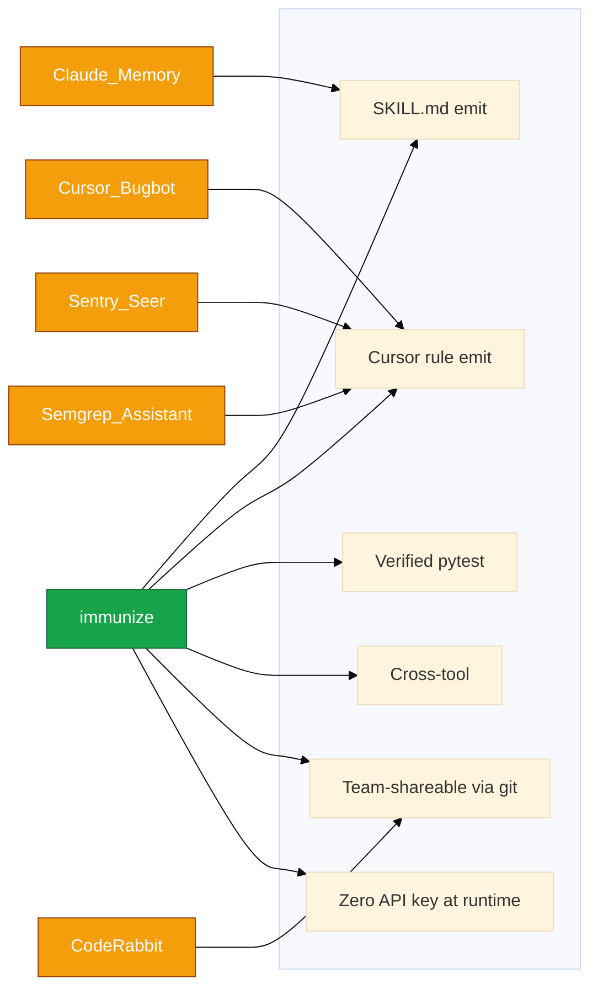

Only `immunize` ships **all six** at once. Verified regression tests are the structural moat — every other tool in this space stops at "we found a problem"; `immunize` proves the fix.

---

## Architecture at a glance

Three layers separate concerns cleanly: triggers, the engine, and the artifacts that land in your repo.

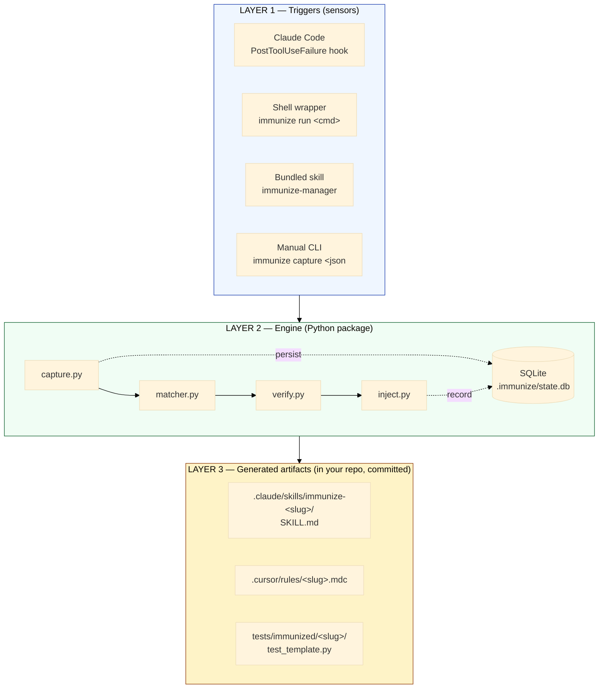

- **Layer 1** is plural by design. A single failure can arrive from a Claude Code hook, a `immunize run` subprocess, the bundled skill nudging the model, or a manual JSON pipe.
- **Layer 2** is one pipeline: capture → match → verify → inject. Pure Python. No network, no API key.
- **Layer 3** is the durable output — committed to git, picked up automatically on `git pull` by every assistant the team uses.

---

## End-to-end pipeline

The same five-step pipeline runs no matter which trigger fires:

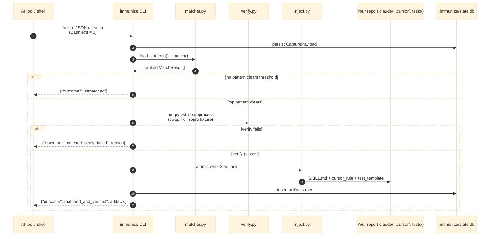

Stdout is a **strict one-line JSON contract**; Rich console output goes to stderr. Hook handlers can trust the shape.

### Decision tree at the matcher

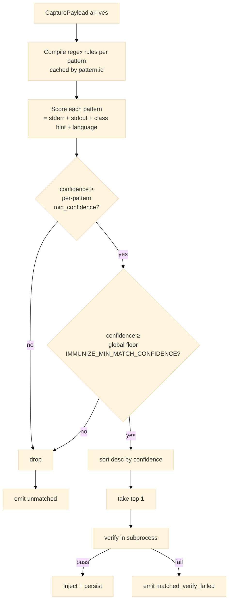

Each gate is documented in [`src/immunize/matcher.py`](./src/immunize/matcher.py) and [`src/immunize/cli.py`](./src/immunize/cli.py).

---

## Quickstart

```bash
pip install immunize        # core wheel — zero LLM dependencies
cd your-project
immunize install-skill      # drops .claude/skills/immunize-manager/SKILL.md
immunize install-hook       # registers .claude/settings.json PostToolUseFailure hook
```

Restart Claude Code. From this point on, every failed `Bash` tool call inside Claude Code feeds `immunize capture` automatically. When a known error class hits — `AttributeError: 'NoneType'`, `ModuleNotFoundError`, a 429 crash, a CORS preflight rejection — three files appear in your repo. Commit them.

**Outside Claude Code** (Cursor, plain shells, CI):

```bash
immunize run pytest tests/
immunize run npm test
immunize run python manage.py migrate
```

`immunize run` tees output live, propagates exit codes, and on non-zero exit feeds the same matcher pipeline.

---

## The four trigger paths

Four entry points, one engine. Picking the right one is just a matter of where your failures originate.

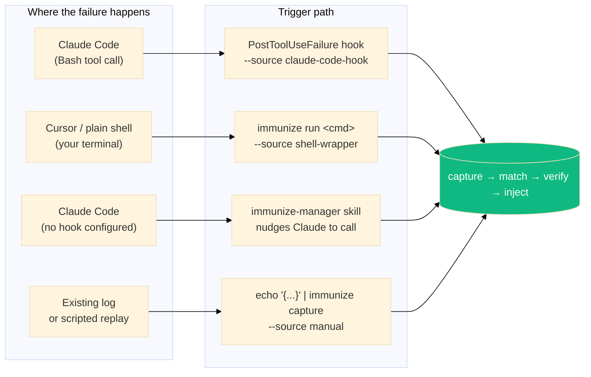

| Path | Set up by | Streams output? | Best for |
|---|---|---|---|
| **Hook** | `immunize install-hook` | n/a (Claude shows it) | Zero-touch automation in Claude Code |
| **`immunize run`** | nothing — invoke per command | Yes (live tee) | CI, Cursor, bare shells |
| **Bundled skill** | `immunize install-skill` | n/a | Falls back to `immunize run` when no hook |
| **Manual `capture`** | hand-built JSON | n/a | Replays, scripted captures, testing |

The hook payload is translated by [`payload_from_claude_code_hook`](./src/immunize/capture.py) into a `CapturePayload` — non-Bash failures are skipped cleanly, never producing noisy unmatched captures.

---

## Pattern matching internals

A `Pattern` is a five-file directory under [`src/immunize/patterns/<slug>/`](./src/immunize/patterns/) and a YAML descriptor. The matcher scores each candidate by combining four signals:

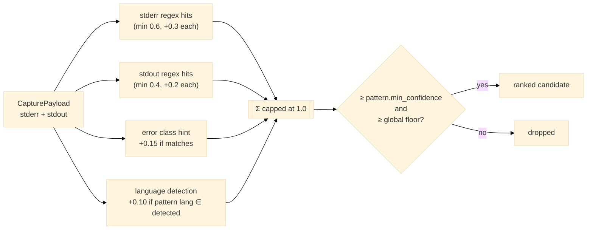

Implementation references:

- Score breakdown — [`score_pattern`](./src/immunize/matcher.py)
- Error class keyword set — [`ERROR_CLASS_HINTS`](./src/immunize/matcher.py) (`cors`, `import`, `auth`, `rate_limit`, `type_error`, `null_ref`, `config`, `network`)
- Language signatures — [`_LANGUAGE_SIGNATURES`](./src/immunize/matcher.py) (`python`, `javascript`, `typescript`, `go`, `rust`)
- Word-bounded keyword regex — fixes the latent collision where `ENOTFOUND` substring-matched inside `ModuleNotFoundError`.
- Float epsilon (`1e-9`) — defends `0.3 + 0.15 ≥ 0.45` from IEEE-754 imprecision.

### Two thresholds, one authoritative source

| Layer | Field | Default | Purpose |
|---|---|---|---|
| Per-pattern | `pattern.match.min_confidence` | varies (0.30–0.50) | Authored against real-world stderr |
| Global floor | `Settings.min_match_confidence` | `0.30` | Operator escape hatch (raise via `IMMUNIZE_MIN_MATCH_CONFIDENCE` for CI strict mode) |

Pre-`v0.2.0` the global floor was `0.70` and silently shadowed every per-pattern threshold below it; calibration data and the rationale live in [`_planning/MATCHER_CALIBRATION_V020.md`](./_planning/MATCHER_CALIBRATION_V020.md).

---

## Verification harness

A pattern only ships if its pytest **fails** without the fix and **passes** with it. The harness re-checks the *passes-with-fix* half on the user's machine before injecting, catching environment drift (missing optional deps, pytest version skew):

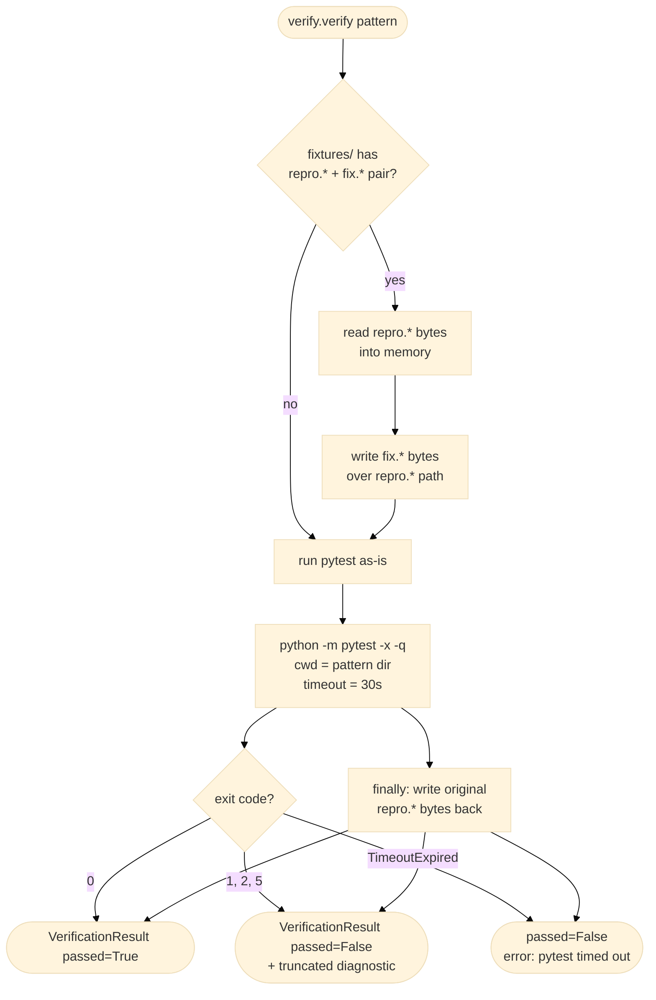

Reference: [`verify.verify`](./src/immunize/verify.py) (user-runtime swap), [`scripts/pattern_lint.py`](./scripts/pattern_lint.py) (CI dual-run: FAIL → PASS → FAIL-after-restore).

The CI path is stricter than runtime — it runs the full three-phase swap so a broken pattern can never be merged in the first place.

---

## Artifact injection

Three files land in fixed paths inside the user's project, each via an atomic write (PID-suffixed temp + `os.replace`):

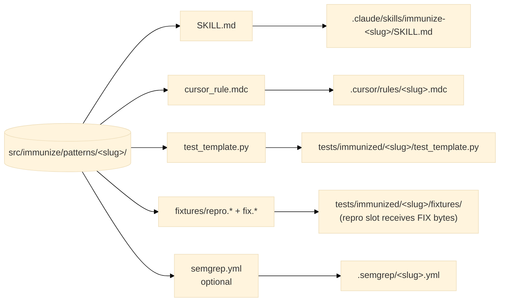

Two subtleties matter and are guarded by tests:

1. **Repro-slot rewrite.** `test_template.py` reads `fixtures/repro.*`. If we copied the pattern's buggy repro verbatim, the injected guardrail would *fail* against itself. [`_copy_fixtures_with_repro_rewrite`](./src/immunize/inject.py) writes the **fix** bytes into the repro path — keeping the test's path expression unchanged while shipping a passing regression test. Source-tree repros stay intact for `pattern_lint`.
2. **Slug collision.** [`resolve_slug`](./src/immunize/inject.py) probes 99 candidates (`base`, `base-2`, …, `base-99`) against both the SQLite `artifacts` table and the on-disk paths. If exhausted, `SlugExhaustedError` instructs the user to run `immunize remove`.

---

## Bundled pattern library

Seven patterns ship in `v0.2.x`, calibrated against 35+ real-world stderr samples. Recall details in [`_planning/MATCHER_CALIBRATION_V020.md`](./_planning/MATCHER_CALIBRATION_V020.md).

| ID | Languages | Class | Threshold | Catches |
|---|---|---|---|---|
| [`react-hook-missing-dep`](./src/immunize/patterns/react-hook-missing-dep/) | js, ts | lint | 0.30 | `useEffect`/`useCallback`/`useMemo` referencing reactive values not in deps array (matches the canonical `react-hooks/exhaustive-deps` rule ID) |
| [`fetch-missing-credentials`](./src/immunize/patterns/fetch-missing-credentials/) | js, ts | cors | 0.45 | Cross-origin authenticated `fetch` without `credentials: 'include'` (Chrome + Firefox phrasings) |
| [`python-none-attribute-access`](./src/immunize/patterns/python-none-attribute-access/) | python | null_ref | 0.30 | `AttributeError: 'NoneType' object has no attribute …` and `TypeError: 'NoneType' object is not subscriptable` |
| [`import-not-found-python`](./src/immunize/patterns/import-not-found-python/) | python | import | 0.50 | `ModuleNotFoundError` and `ImportError: cannot import name` |
| [`missing-env-var`](./src/immunize/patterns/missing-env-var/) | python | config | 0.40 | `KeyError: 'UPPER_SNAKE'` from `os.environ['…']` access |
| [`rate-limit-no-backoff`](./src/immunize/patterns/rate-limit-no-backoff/) | python | rate_limit | 0.45 | `429 Too Many Requests`, `RateLimitError`, `HTTPError … 429`, `rate_limit_error` SDK responses |
| [`async-fn-called-without-await`](./src/immunize/patterns/async-fn-called-without-await/) | python | async | 0.30 | `coroutine '<name>' was never awaited` |

Each directory contains:

```
<slug>/
├── pattern.yaml         # metadata + match rules + verification config
├── SKILL.md             # Claude Code skill (frontmatter: name, description)
├── cursor_rule.mdc      # Cursor rule  (frontmatter: description, globs, alwaysApply)
├── test_template.py     # pytest assertion that proves the fix
└── fixtures/
    ├── repro.<ext>      # buggy form  — test fails against this
    └── fix.<ext>        # correct form — test passes against this
```

---

## CLI reference

`immunize` ships eight commands. Help on each: `immunize <cmd> --help`.

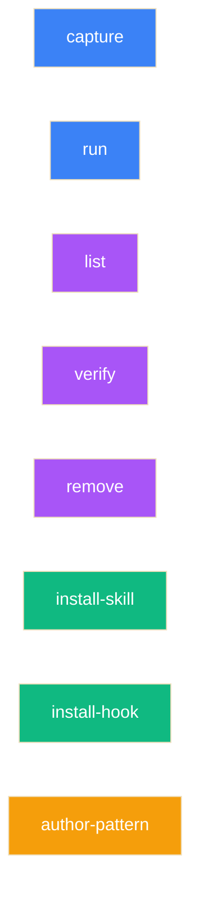

| Command | Purpose |
|---|---|
| `immunize capture [--source S] [--stdin-plain] [--dry-run]` | Match → verify → inject from a JSON or plain-stderr stdin payload. Emits one JSON line on stdout. |
| `immunize run [--timeout N] [--no-capture] -- <cmd> [args]` | Spawn `<cmd>`, tee output live, propagate exit code, auto-capture on non-zero exit. |
| `immunize list` | Table of every immunity active in the project. |
| `immunize verify [<id\|slug>]` | Re-run pytest against one (or all) injected immunities. |
| `immunize remove <id\|slug> [--yes]` | Delete artifacts and SQLite row for an immunity. |
| `immunize install-skill [--project-dir PATH] [--force]` | Copy bundled `immunize-manager` skill into `.claude/skills/`. |
| `immunize install-hook [--project-dir PATH] [--force]` | Register the `PostToolUseFailure` hook in `.claude/settings.json`. |
| `immunize author-pattern --from-error E.json --output DIR [--model M]` | **Contributor-only.** Drafts a new bundled pattern via Claude API; lives behind `pip install 'immunize[author]'`. |

### `immunize capture` JSON output contract

Exactly one of these shapes on stdout (always exit 0 unless the CLI itself is broken):

```jsonc
// matched + verified → 3 files written
{
  "outcome": "matched_and_verified",
  "matched": true,
  "verified": true,
  "pattern_id": "python-none-attribute-access",
  "pattern_origin": "bundled",
  "confidence": 0.55,
  "artifacts": {
    "skill":       "/abs/.claude/skills/immunize-python-none-attribute-access/SKILL.md",
    "cursor_rule": "/abs/.cursor/rules/python-none-attribute-access.mdc",
    "pytest":      "/abs/tests/immunized/python-none-attribute-access/test_template.py"
  }
}

// matched but verify failed in this env (e.g. pytest missing) → no files written
{ "outcome": "matched_verify_failed", "matched": true, "verified": false,
  "pattern_id": "...", "pattern_origin": "bundled",
  "confidence": 0.55, "reason": "pytest is not installed in this environment. Run: pip install pytest" }

// no pattern cleared threshold
{ "outcome": "unmatched", "matched": false, "can_author_locally": true }

// hook fired but it wasn't a Bash failure
{ "outcome": "skipped", "reason": "non-Bash tool failure", "tool_name": "Edit" }
```

Rich-formatted, human-readable output goes to **stderr**. Stdout is for machines.

---

## Configuration

Settings resolve highest-priority first:

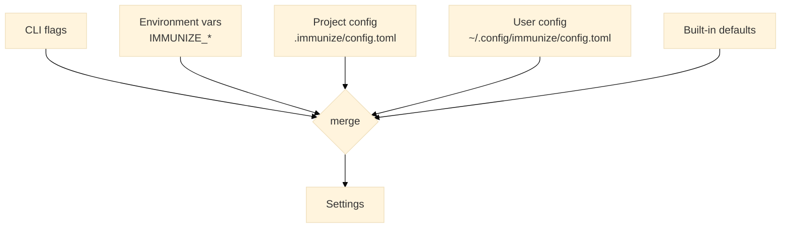

| Setting | TOML key | Env var | Default |
|---|---|---|---|
| LLM model (authoring only) | `model` | `IMMUNIZE_MODEL` | `claude-sonnet-4-6` |
| Verify timeout (seconds) | `[verify] timeout_seconds` | `IMMUNIZE_VERIFY_TIMEOUT_SECONDS` | `30` |
| Verify retry count | `[verify] retry_count` | `IMMUNIZE_VERIFY_RETRY_COUNT` | `1` |
| Global match floor | `[match] min_confidence` | `IMMUNIZE_MIN_MATCH_CONFIDENCE` | `0.30` |
| Local patterns dir | `[match] local_patterns_dir` | `IMMUNIZE_LOCAL_PATTERNS_DIR` | `.immunize/patterns_local/` |
| Generate semgrep YAML | `[generate] semgrep` | `IMMUNIZE_GENERATE_SEMGREP` | `false` |

Two operational toggles:

- **`IMMUNIZE_DEBUG_HOOK=1`** — dump every Claude Code hook payload to `.immunize/hook_payloads/<ts>-<session>.json` for offline inspection (auto-gitignored).
- **`IMMUNIZE_MIN_MATCH_CONFIDENCE=0.6`** — global floor knob; useful in CI strict mode.

---

## Project layout

```text
immunize/
├── pyproject.toml                       # hatchling build, runtime deps, [author]/[dev] extras
├── README.md                            # this file
├── CHANGELOG.md                         # Keep-a-Changelog formatted history
├── CONTRIBUTING.md                      # dev setup + pattern authoring workflow
├── LICENSE                              # Apache-2.0
├── Makefile                             # install / test / lint / format / build / clean
├── .pre-commit-config.yaml              # ruff (check + format)
├── .github/workflows/
│   ├── ci.yml                           # pytest matrix (3.10/3.11/3.12) + pattern_lint
│   └── release.yml                      # tag-driven PyPI publish via OIDC
├── _planning/                           # design docs (architecture, spec, calibration, …)
├── scripts/
│   └── pattern_lint.py                  # CI gate: structural + behavioral pattern check
├── src/immunize/
│   ├── __init__.py                      # __version__
│   ├── __main__.py                      # `python -m immunize`
│   ├── cli.py                           # Typer app + 8 commands
│   ├── capture.py                       # stdin parsing, hook translation, fingerprinting
│   ├── matcher.py                       # regex compile + score + threshold
│   ├── verify.py                        # pytest subprocess + fix→repro swap
│   ├── inject.py                        # atomic writes + slug collision resolution
│   ├── runner.py                        # `immunize run` subprocess wrapper (tee threads)
│   ├── hook_installer.py                # idempotent merge into .claude/settings.json
│   ├── skill_install.py                 # copy bundled skill into project
│   ├── storage.py                       # SQLite schema, in-place migration, queries
│   ├── config.py                        # toml + env + CLI override merge
│   ├── models.py                        # Pydantic v2: CapturePayload, Pattern, Settings, …
│   ├── authoring/
│   │   └── cli_author.py                # `author-pattern` (lazy-imports anthropic)
│   ├── patterns/                        # 7 bundled patterns (slug-named dirs)
│   └── skill_assets/
│       └── immunize-manager/SKILL.md    # bundled skill
└── tests/                               # 19 test modules covering every module
```

---

## Data model

Pydantic v2 models in [`src/immunize/models.py`](./src/immunize/models.py) define the contract:

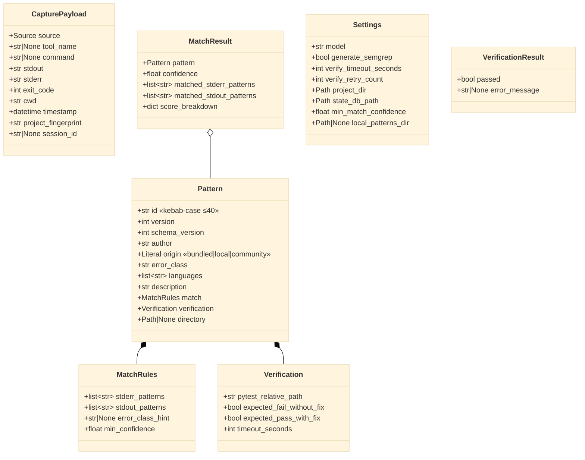

Source enum: `"claude-code-hook" | "shell-wrapper" | "manual"`. The CLI rejects any other value before persisting.

---

## Authoring new patterns

Two paths produce the same five-file directory shape on disk:

### Path 1 — LLM-assisted (contributor only)

```bash
pip install 'immunize[author]'
export ANTHROPIC_API_KEY=sk-ant-...
immunize author-pattern \
  --from-error path/to/error.json \
  --output src/immunize/patterns/
```

Internally:

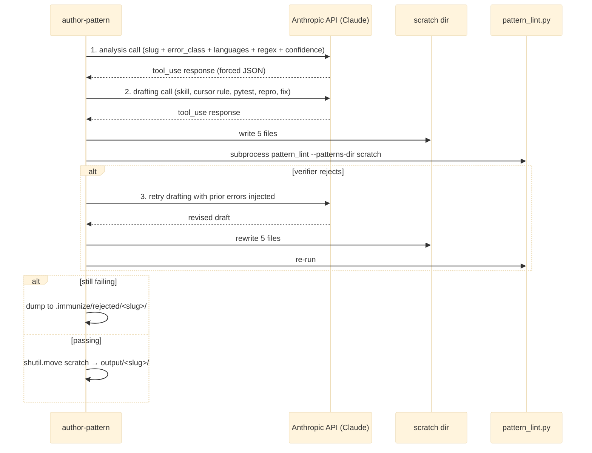

The Anthropic SDK is **only** imported here. End-user installs of `immunize` never pull `anthropic`, `httpx`, or `jiter` — it is gated behind the `[author]` extra.

### Path 2 — manual

Copy an existing pattern (e.g. [`python-none-attribute-access`](./src/immunize/patterns/python-none-attribute-access/)), adapt the YAML, SKILL, rule, test, and fixtures. Then:

```bash
python scripts/pattern_lint.py
```

`pattern_lint` enforces the **Ten Commandments** of pattern quality (full text in [`_planning/PATTERN_AUTHORING.md`](./_planning/PATTERN_AUTHORING.md)). The most consequential:

> 1. A pattern earns its slug. Generic names rejected.
> 2. Patterns test defaults, not knobs.
> 3. `repro.*` and `fix.*` must differ observably under the same test.
> 4. Stderr regex anchors on signal, not noise.
> 5. `min_confidence` is honest.
> 6. SKILL.md teaches, doesn't lecture.
> 7. No URLs in SKILL.md.
> 8. Languages list is precise.
> 9. Never wrap domain knowledge.
> 10. If the test is flaky, the pattern is wrong.

---

## State storage

A SQLite database at `<project>/.immunize/state.db` tracks captures and injections. Schema (see [`storage.py`](./src/immunize/storage.py)):

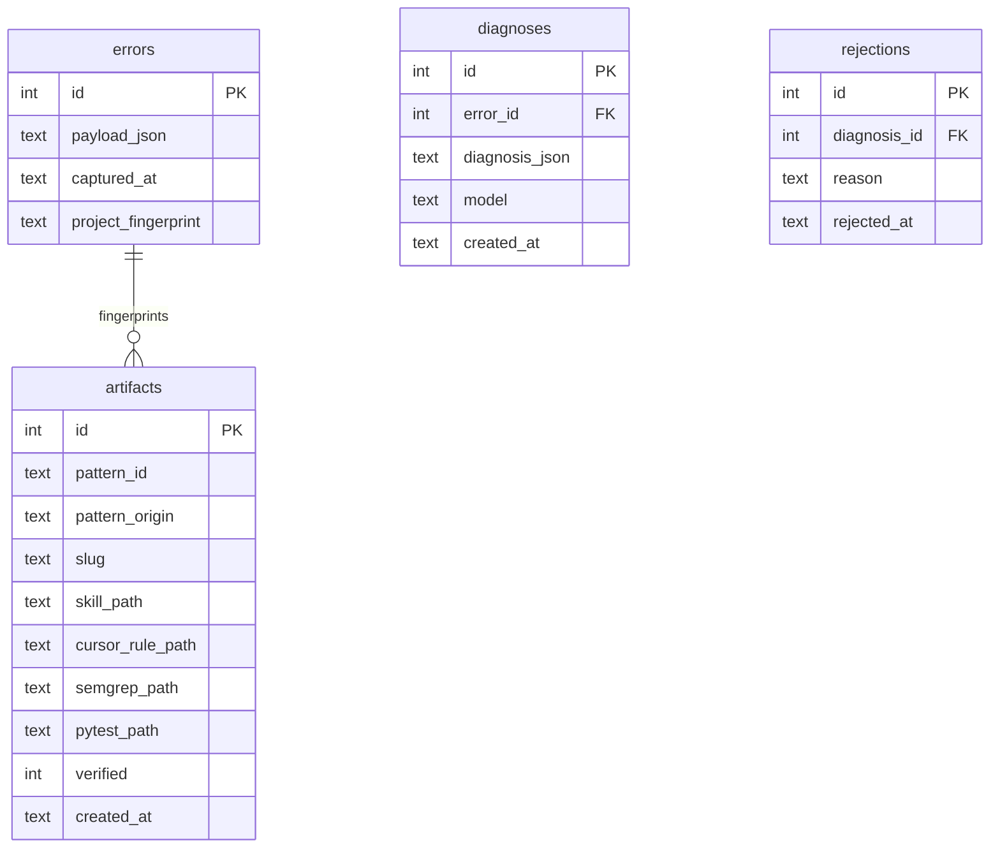

`diagnoses` survives from the pre-`v0.1` LLM-at-runtime architecture for backward compat; the matcher pipeline writes only to `errors` and `artifacts`. An in-place migration in [`_migrate_artifacts_if_needed`](./src/immunize/storage.py) upgrades legacy schemas on first connect.

The DB is **local state only** — auto-`.gitignore`d via the install-hook flow. Shared state is the committed artifact files.

---

## Security & privacy

| Concern | Stance |
|---|---|
| LLM at runtime | **Never.** The matcher is regex; verify is pytest in subprocess; inject is `os.replace`. The Anthropic SDK is unreachable from the `capture` import graph. |
| Network calls | **Never** at user-runtime. `author-pattern` (contributor) is the sole exception, gated behind the `[author]` extra and an explicit `ANTHROPIC_API_KEY`. |
| Stderr exfiltration | Stderr is persisted only to local SQLite under `.immunize/`. Hook payload dumps are off by default and gitignored. |
| Atomic writes | Every artifact write is PID-suffixed temp + `os.replace`. Concurrent immunize processes (e.g. a hook firing during a manual capture) never observe a partial file. |
| Hook scope | We modify project-scope `.claude/settings.json` only, never user-scope `~/.claude/settings.json` (a global hook would fire in unrelated projects). |
| Idempotence | `install-hook` and `install-skill` are no-ops on identical re-invocation; `--force` is required to overwrite drifted entries. |
| OS support | POSIX only (macOS/Linux). The CLI guard refuses to run on `win32` with a clear message. Windows on the roadmap. |

---

## Continuous integration

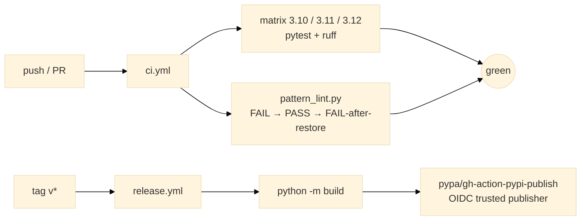

- **`ci.yml`** — installs `[dev]` extras, runs `ruff check .`, `pytest`, and `python scripts/pattern_lint.py` on three Python versions in parallel.
- **`release.yml`** — fires on `v*` tag pushes, builds wheel + sdist, and publishes to PyPI via OIDC trusted publishing (no API tokens stored).

---

## Roadmap

Tracked in [`_planning/LAUNCH_LIBRARY.md`](./_planning/LAUNCH_LIBRARY.md) and CHANGELOG entries.

| Version | Theme | Status |
|---|---|---|
| `v0.1.x` | Core pipeline, 7 bundled patterns, manual capture | shipped |
| `v0.2.x` | Claude Code hook automation, `immunize run`, calibrated matcher | **current** |
| `v0.3.x` | Native test runners (Jest/Go/cargo), Windows support, more patterns | planned |
| `v0.4+` | Community pattern registry, IDE-side telemetry opt-in | exploratory |

Explicit non-goals: web dashboard, MCP server, always-on shell daemon, IDE extensions. The premise is to *emit files the existing tools already read*.

---

## Contributing

Contributions — especially new patterns — are warmly welcomed. Start with [`CONTRIBUTING.md`](./CONTRIBUTING.md) for dev setup and [`_planning/PATTERN_AUTHORING.md`](./_planning/PATTERN_AUTHORING.md) for the Ten Commandments.

```bash
git clone https://github.com/viditkbhatnagar/immunize.git
cd immunize
python -m venv .venv && source .venv/bin/activate
pip install -e ".[dev]"
pre-commit install
make test                              # full pytest suite
python scripts/pattern_lint.py         # validate every bundled pattern
```

PRs land via GitHub. One pattern per PR. CI must be green.

---

## License

Apache-2.0 — see [LICENSE](./LICENSE).

<div align="center">

<sub>Built with Python 3.10+, Typer, Pydantic v2, Rich, and pytest. No LangChain. No daemons. No telemetry.</sub>

</div>
